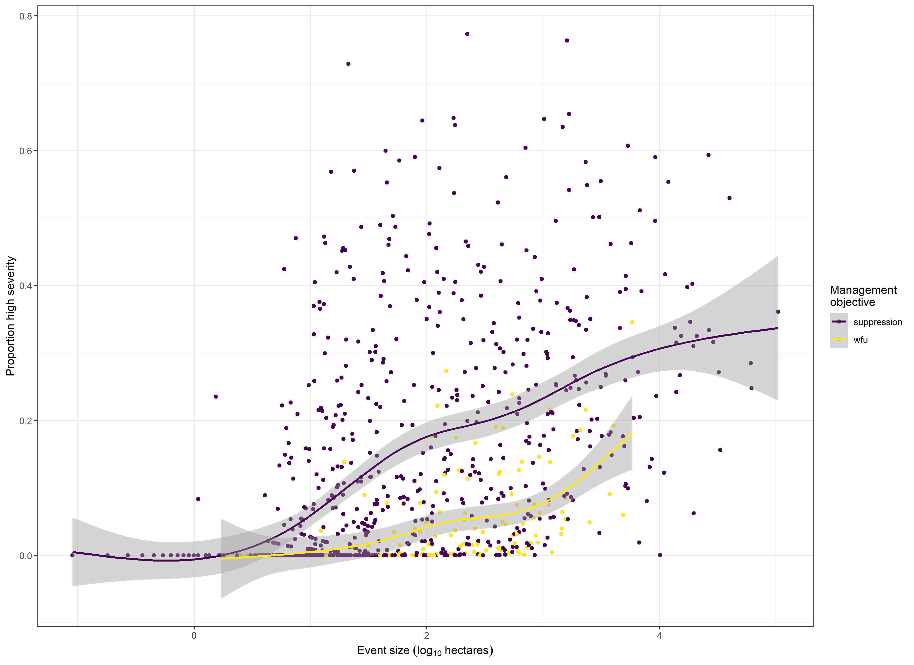

```{r setup, include=FALSE}
knitr::opts_chunk$set(echo = TRUE)
```

## Significance 

We've identified a clear selection bias in the distribution of fire burning conditions, and thus fire effects, arising from initial suppression efforts. We measured this effect using a formal means of measuring selection, borrowed from the evolutionary ecology framework of phenotypic selection.

## Future directions

2) What are the consequences of these varying conditions for wildfire effects (burn duration, fire event size, severity configurations)?

3) To what extent might prematurely extinguished suppression wildfires exhibit desireable fire effects, were they to be allowed to burn for longer? That is, are small suppression fires behaving like small wildfire use fires (and thus they should perhaps be left to burn and cover more area)?

### Effect of a typical fire versus the typical effect of a fire

Most fires are small, and some are small because they undergo active suppression. We have demonstrated that there is a bias toward extreme burning conditions imposed by suppression that increases with minimum fire size being analyzed. Thus, databases of fire effects that include large fires (e.g., MTBS) have this bias baked in for the Sierra yellow pine/mixed-conifer system.

@cansler2014 included small fires when measuring fire effects.

@steel2018 found only a small difference in the measure of regional climate during suppression versus wildfire use fires (modeled fuel moisture), which led to the conclusion that an "extreme fuel" effect underlied the differences in the size/configuration of high and unburned severity patches. 

But that analysis only included fires greater than 80 hectares in size, which is still pretty big. Analyzing big fires made sense for that paper, because they affect the most area, but if we want to suggest "let fires burn at more moderate weather conditions" as a mitigation strategy for a century of making fuel conditions more extreme, then I think this paper would serve the purpose of measuring the degree to which good work can be done by a fire (even in extreme fuel conditions) in milder weather conditions. 

Fuels are of particular interest because they can be modified [@agee2005]

Coarse-scale influence of management on fire effects [@meyer2015; @harris2015; @lydersen2017; @stevens2017; @steel2018]

### Positive feedback after selection

Forest structure and fuel characteristics link one disturbance event to the next via feedbacks: one wildfire changes the fuel characteristics of the forest as it burns, and those altered fuel characteristics can feedback to influence the behavior and effects of the next wildfire. In Sierra YPMC, severe wildfires with stand-replacing effects, especially large, contiguous stand-replacing effects, tend to homogenize forest spatial structure. In turn, homogenous forest structure increases the probability that a forest will burn at high severity [@koontz2019a]. If initial attack suppression selects for wildfires to burn under more homogenous fuel conditions, and those fires are more likely to burn at high severity, then the vegetation within the footprint of those fires will be more likely to regenerate homogeneously, thus "inheriting" the phenotype that was selected for. 

On a longer time scale, this is perhaps true for the regional climate trait that suppression also selects for: selection for fires burning under hotter/drier conditions will likely lead to more severe wildfires, with greater release of carbon to the atmosphere, greater climate forcing, and increasingly common hot/dry conditions. In this case, the selection for fires burning under hotter/drier conditions also leads to "inheritance" of the hotter/drier phenotype for future fires.

### Case study of many simultaneously burning fires

We subsetted the @koontz2019a dataset to all fires with greater than or equal to 20 other fires burning on its alarm date. Many of these fires were ignited during the June 21-22, 2008 storms in the Sierra Nevada.

### Selection effect broken down by lightning- vs. human-caused ignitions

...why no detectable effect of windspeed...
Finally, our analysis averaged across all ignition types, while @abatzoglou2018a specifically addressed the role of windspeed in human- versus lightning-ignitions, finding the strongest effect in human ignitions.
 
 "A variety of environmental and social factors influence wildfire growth and whether a fire overcomes initial attack efforts and becomes a large wildfire. However, little is known about how these factors differ between lightning-caused and human-caused wildfires." [@abatzoglou2018a]



The distribution of fire event sizes is directly influenced by suppression efforts-- extinguishing a fire constrains the area of its effect, and the distribution of severity of fire effects to vegetation is indirectly influenced by suppression efforts-- fires

